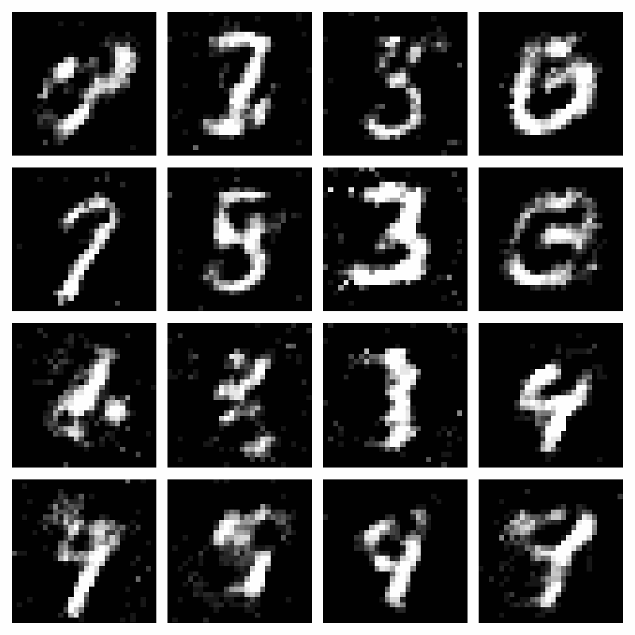

# MNIST GAN Generator

A simple Generative Adversarial Network (GAN) implementation for generating MNIST-like digits using PyTorch. This project provides a basic framework for understanding and experimenting with GANs.

## Overview

This project implements a basic GAN architecture to generate handwritten digits similar to those in the MNIST dataset. The implementation uses fully connected layers and is designed to run in Google Colab for easy accessibility.




## Features

- Simple GAN architecture with fully connected layers
- GPU support for faster training
- Real-time visualization of generated images during training
- Loss tracking and visualization
- MNIST dataset handling
- Google Colab compatibility

## Requirements

```
torch
torchvision
matplotlib
numpy
```

## Architecture

### Generator
- Input: Random noise vector (latent_dim=100)
- Hidden layers with LeakyReLU activation and BatchNorm
- Output: 784-dimensional vector (28x28 image)
- Tanh activation for final layer

### Discriminator
- Input: 784-dimensional vector (28x28 image)
- Hidden layers with LeakyReLU activation and Dropout
- Output: Single value (0-1) through Sigmoid activation

## Hyperparameters

- Latent dimension: 100
- Hidden dimension: 256
- Learning rate: 0.0002
- Batch size: 128
- Number of epochs: 100
- Adam optimizer with beta1=0.5, beta2=0.999

## Usage

1. Open the notebook in Google Colab
2. Enable GPU runtime:
   - Runtime → Change runtime type → GPU
3. Run all cells
4. The training will show:
   - Progress updates every 100 steps
   - Generated samples every 500 steps
   - Final loss plots and generated images

## Results

The model will generate digits that resemble handwritten numbers from the MNIST dataset. Quality of results may vary due to:
- The simple fully connected architecture
- Training duration
- Random initialization
- Hyperparameter settings

## Possible Improvements

1. Architecture:
   - Implement convolutional layers (DCGAN)
   - Add more layers or increase layer width
   - Experiment with different activation functions

2. Training:
   - Adjust learning rates
   - Implement learning rate scheduling
   - Add more sophisticated loss functions
   - Implement progressive growing

3. Features:
   - Add model checkpointing
   - Implement early stopping
   - Add conditional generation
   - Include interpolation in latent space

## License

This project is provided for educational purposes and is available under the MIT License.

## Acknowledgments

- The MNIST Dataset (Yann LeCun and Corinna Cortes)
- PyTorch Documentation and Tutorials

## Support

For issues and questions:
1. Check the existing documentation
2. Review PyTorch's documentation
3. Create an issue in the repository

Happy generating! 🎨
